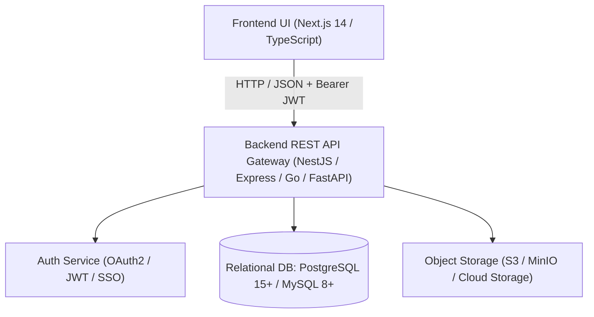
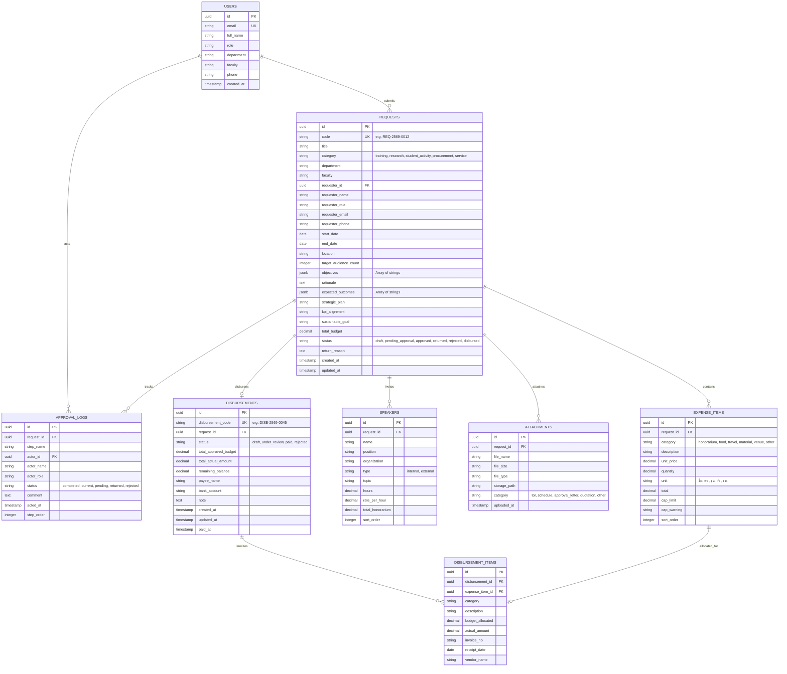
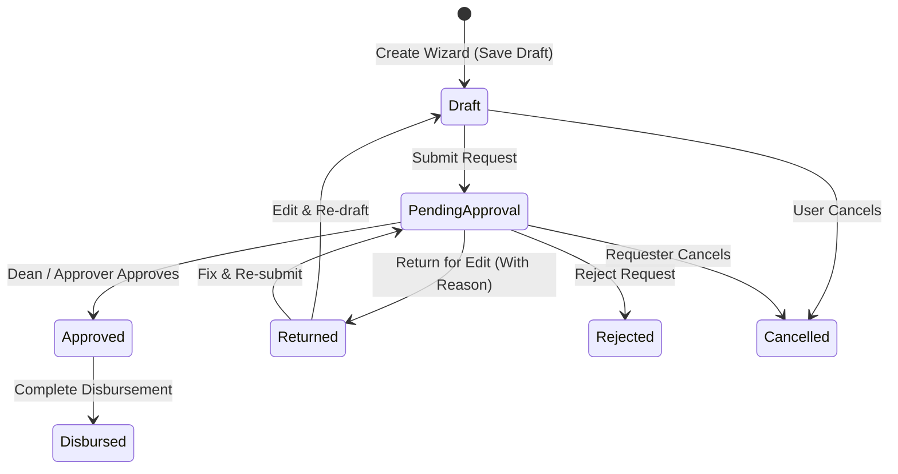

# PEMA — Project & Expense Management Application
## Backend & Database Architecture Specification Guide

เอกสารคู่มือสถาปัตยกรรมและข้อกำหนดทางเทคนิคสำหรับการพัฒนา **Backend API** และ **Database** เพื่อเชื่อมต่อกับระบบ **Frontend UX/UI (PEMA Next.js App Router)** อย่างสมบูรณ์

---

## 📑 สารบัญ
1. [ภาพรวมสถาปัตยกรรมระบบ (Architecture Overview)](#1-ภาพรวมสถาปัตยกรรมระบบ-architecture-overview)
2. [การออกแบบฐานข้อมูล (Database Schema & ERD)](#2-การออกแบบฐานข้อมูล-database-schema--erd)
3. [วงจรสถานะและการทำงาน (State Machine & Workflow)](#3-วงจรสถานะและการทำงาน-state-machine--workflow)
4. [ข้อกำหนด API Endpoints (RESTful API Specification)](#4-ข้อกำหนด-api-endpoints-restful-api-specification)
5. [กฎทางธุรกิจและการคำนวณ (Business Rules & Cap Engine)](#5-กฎทางธุรกิจและการคำนวณ-business-rules--cap-engine)
6. [มาตรฐานการจัดการข้อผิดพลาด (Validation & Error Mapping)](#6-มาตรฐานการจัดการข้อผิดพลาด-validation--error-mapping)
7. [ระบบสิทธิ์และการยืนยันตัวตน (Authentication & RBAC)](#7-ระบบสิทธิ์และการยืนยันตัวตน-authentication--rbac)
8. [ระบบจัดเก็บไฟล์แนบ (File Storage Architecture)](#8-ระบบจัดเก็บไฟล์แนบ-file-storage-architecture)
9. [ชุดข้อมูลทดสอบมาตรฐาน (Fixtures & Initial States)](#9-ชุดข้อมูลทดสอบมาตรฐาน-fixtures--initial-states)

---

## 1. ภาพรวมสถาปัตยกรรมระบบ (Architecture Overview)



- **Frontend Standard**: Next.js App Router (Client & Server Components)
- **Data Exchange**: JSON ผ่าน HTTPS REST API
- **Color Theme Reference**: Primary `#A73B24` (สีดินแดง Red Earth: CMYK C24 M88 Y99 K17 / RGB 167,59,36), Secondary `#C85A3D`, Accent `#F59E0B`, BG `#FAF7F5`, Surface `#FFFFFF`, Text `#1C1917`

---

## 2. การออกแบบฐานข้อมูล (Database Schema & ERD)

### 2.1 แผนภาพความสัมพันธ์เชิงข้อมูล (Entity Relationship Diagram)



### 2.2 SQL DDL Schema (PostgreSQL 15+)

```sql
-- 1. Enable UUID Extension
CREATE EXTENSION IF NOT EXISTS "uuid-ossp";

-- 2. Users Table
CREATE TABLE users (
    id UUID PRIMARY KEY DEFAULT uuid_generate_v4(),
    email VARCHAR(255) UNIQUE NOT NULL,
    full_name VARCHAR(255) NOT NULL,
    role VARCHAR(50) NOT NULL, -- 'requester', 'department_head', 'budget_officer', 'dean', 'admin'
    department VARCHAR(255) NOT NULL,
    faculty VARCHAR(255) NOT NULL,
    phone VARCHAR(50),
    created_at TIMESTAMPTZ DEFAULT CURRENT_TIMESTAMP
);

-- 3. Requests Table
CREATE TABLE requests (
    id UUID PRIMARY KEY DEFAULT uuid_generate_v4(),
    code VARCHAR(50) UNIQUE NOT NULL,
    title VARCHAR(500) NOT NULL,
    category VARCHAR(50) NOT NULL CHECK (category IN ('training', 'research', 'student_activity', 'procurement', 'service')),
    department VARCHAR(255) NOT NULL,
    faculty VARCHAR(255) NOT NULL,
    requester_id UUID REFERENCES users(id) ON DELETE SET NULL,
    requester_name VARCHAR(255) NOT NULL,
    requester_role VARCHAR(255) NOT NULL,
    requester_email VARCHAR(255) NOT NULL,
    requester_phone VARCHAR(50),
    start_date DATE NOT NULL,
    end_date DATE NOT NULL,
    location VARCHAR(500) NOT NULL,
    target_audience_count INT DEFAULT 1,
    objectives JSONB DEFAULT '[]'::jsonb,
    rationale TEXT,
    expected_outcomes JSONB DEFAULT '[]'::jsonb,
    strategic_plan VARCHAR(500) NOT NULL,
    kpi_alignment VARCHAR(500) NOT NULL,
    sustainable_goal VARCHAR(255),
    total_budget NUMERIC(14, 2) NOT NULL DEFAULT 0.00,
    status VARCHAR(50) NOT NULL DEFAULT 'draft' CHECK (status IN ('draft', 'pending_approval', 'approved', 'returned', 'rejected', 'disbursed')),
    return_reason TEXT,
    created_at TIMESTAMPTZ DEFAULT CURRENT_TIMESTAMP,
    updated_at TIMESTAMPTZ DEFAULT CURRENT_TIMESTAMP
);

CREATE INDEX idx_requests_status ON requests(status);
CREATE INDEX idx_requests_category ON requests(category);
CREATE INDEX idx_requests_requester ON requests(requester_id);
CREATE INDEX idx_requests_created_at ON requests(created_at DESC);

-- 4. Expense Items Table
CREATE TABLE expense_items (
    id UUID PRIMARY KEY DEFAULT uuid_generate_v4(),
    request_id UUID NOT NULL REFERENCES requests(id) ON DELETE CASCADE,
    category VARCHAR(50) NOT NULL CHECK (category IN ('honorarium', 'food', 'travel', 'material', 'venue', 'other')),
    description TEXT NOT NULL,
    unit_price NUMERIC(12, 2) NOT NULL DEFAULT 0.00,
    quantity NUMERIC(10, 2) NOT NULL DEFAULT 1.00,
    unit VARCHAR(50) NOT NULL,
    total NUMERIC(14, 2) GENERATED ALWAYS AS (unit_price * quantity) STORED,
    cap_limit NUMERIC(12, 2),
    cap_warning VARCHAR(255),
    sort_order INT DEFAULT 0
);

CREATE INDEX idx_expense_items_request ON expense_items(request_id);

-- 5. Speakers Table
CREATE TABLE speakers (
    id UUID PRIMARY KEY DEFAULT uuid_generate_v4(),
    request_id UUID NOT NULL REFERENCES requests(id) ON DELETE CASCADE,
    name VARCHAR(255) NOT NULL,
    position VARCHAR(255),
    organization VARCHAR(255),
    type VARCHAR(20) NOT NULL CHECK (type IN ('internal', 'external')),
    topic TEXT,
    hours NUMERIC(6, 2) NOT NULL DEFAULT 1.00,
    rate_per_hour NUMERIC(10, 2) NOT NULL DEFAULT 0.00,
    total_honorarium NUMERIC(12, 2) GENERATED ALWAYS AS (hours * rate_per_hour) STORED,
    sort_order INT DEFAULT 0
);

CREATE INDEX idx_speakers_request ON speakers(request_id);

-- 6. Attachments Table
CREATE TABLE attachments (
    id UUID PRIMARY KEY DEFAULT uuid_generate_v4(),
    request_id UUID NOT NULL REFERENCES requests(id) ON DELETE CASCADE,
    file_name VARCHAR(255) NOT NULL,
    file_size VARCHAR(50) NOT NULL,
    file_type VARCHAR(100) NOT NULL,
    storage_path VARCHAR(1000) NOT NULL,
    category VARCHAR(50) NOT NULL CHECK (category IN ('tor', 'schedule', 'approval_letter', 'quotation', 'other')),
    uploaded_at TIMESTAMPTZ DEFAULT CURRENT_TIMESTAMP
);

CREATE INDEX idx_attachments_request ON attachments(request_id);

-- 7. Approval Logs Table
CREATE TABLE approval_logs (
    id UUID PRIMARY KEY DEFAULT uuid_generate_v4(),
    request_id UUID NOT NULL REFERENCES requests(id) ON DELETE CASCADE,
    step_name VARCHAR(255) NOT NULL,
    actor_id UUID REFERENCES users(id) ON DELETE SET NULL,
    actor_name VARCHAR(255) NOT NULL,
    actor_role VARCHAR(255) NOT NULL,
    status VARCHAR(50) NOT NULL CHECK (status IN ('completed', 'current', 'pending', 'returned', 'rejected')),
    comment TEXT,
    acted_at TIMESTAMPTZ,
    step_order INT DEFAULT 0
);

CREATE INDEX idx_approval_logs_request ON approval_logs(request_id);

-- 8. Disbursements Table
CREATE TABLE disbursements (
    id UUID PRIMARY KEY DEFAULT uuid_generate_v4(),
    disbursement_code VARCHAR(50) UNIQUE NOT NULL,
    request_id UUID NOT NULL REFERENCES requests(id) ON DELETE RESTRICT,
    status VARCHAR(50) NOT NULL DEFAULT 'draft' CHECK (status IN ('draft', 'under_review', 'paid', 'rejected')),
    total_approved_budget NUMERIC(14, 2) NOT NULL DEFAULT 0.00,
    total_actual_amount NUMERIC(14, 2) NOT NULL DEFAULT 0.00,
    remaining_balance NUMERIC(14, 2) GENERATED ALWAYS AS (total_approved_budget - total_actual_amount) STORED,
    payee_name VARCHAR(255) NOT NULL,
    bank_account VARCHAR(255) NOT NULL,
    note TEXT,
    created_at TIMESTAMPTZ DEFAULT CURRENT_TIMESTAMP,
    updated_at TIMESTAMPTZ DEFAULT CURRENT_TIMESTAMP,
    paid_at TIMESTAMPTZ
);

CREATE INDEX idx_disbursements_request ON disbursements(request_id);
CREATE INDEX idx_disbursements_status ON disbursements(status);

-- 9. Disbursement Items Table
CREATE TABLE disbursement_items (
    id UUID PRIMARY KEY DEFAULT uuid_generate_v4(),
    disbursement_id UUID NOT NULL REFERENCES disbursements(id) ON DELETE CASCADE,
    expense_item_id UUID REFERENCES expense_items(id) ON DELETE SET NULL,
    category VARCHAR(100) NOT NULL,
    description TEXT NOT NULL,
    budget_allocated NUMERIC(12, 2) NOT NULL DEFAULT 0.00,
    actual_amount NUMERIC(12, 2) NOT NULL DEFAULT 0.00,
    invoice_no VARCHAR(100),
    receipt_date DATE,
    vendor_name VARCHAR(255)
);

CREATE INDEX idx_disbursement_items_disbursement ON disbursement_items(disbursement_id);
```

---

## 3. วงจรสถานะและการทำงาน (State Machine & Workflow)



### รายละเอียดการเปลี่ยนสถานะ (Transitions):
| สถานะต้นทาง | Action | สถานะปลายทาง | สิทธิ์ผู้ดำเนินการ | เงื่อนไข / Side Effects |
|---|---|---|---|---|
| `*` (สร้างใหม่) | `SAVE_DRAFT` | `draft` | Requester | บันทึกข้อมูลโดยยังไม่ต้อง Validate required fields ครบ 100% |
| `draft` | `SUBMIT` | `pending_approval` | Requester | Validate ข้อมูลครบ 5 Step, สร้าง Approval Log ขั้นตอนแรก |
| `pending_approval`| `APPROVE` | `approved` | Approver / Dean | บันทึกประวัติอนุมัติ, ปลดล็อกให้สามารถนำไปออกใบเบิกจ่ายได้ |
| `pending_approval`| `RETURN` | `returned` | Approver / Budget | **ต้องระบุ `return_reason`**, ปรากฏใน Action Items บน Dashboard |
| `returned` | `RE_SUBMIT` | `pending_approval` | Requester | ล้าง `return_reason` เดิม และบันทึกข้อความปรับปรุง |
| `approved` | `DISBURSE` | `disbursed` | Finance | บันทึกการจ่ายเงินตามใบเสร็จจริง และคำนวณเงินคงเหลือคืนกองทุน |

---

## 4. ข้อกำหนด API Endpoints (RESTful API Specification)

### Base URL: `/api/v1`

### 4.1 Dashboard Metrics API
#### `GET /api/v1/dashboard/metrics`
- **คำอธิบาย**: ดึงข้อมูลสรุป Dashboard (งานเร่งด่วน, สถิติตัวเลขรวม)
- **Response 200 OK**:
```json
{
  "success": true,
  "data": {
    "totalRequests": 24,
    "pendingApprovalCount": 3,
    "approvedCount": 18,
    "returnedCount": 2,
    "totalBudgetRequested": 1850000.00,
    "totalBudgetApproved": 1620000.00,
    "actionRequiredItems": [
      {
        "id": "req-003",
        "code": "REQ-2569-0010",
        "title": "โครงการค่ายเสริมสร้างจิตสาธารณะนักศึกษา",
        "status": "returned",
        "returnReason": "กรุณาปรับปรุงรายการค่าอาหารไม่เกิน 70 บ./คน",
        "totalBudget": 148000.00
      }
    ]
  }
}
```

---

### 4.2 Requests API

#### `GET /api/v1/requests`
- **Query Parameters**:
  - `search`: string (ค้นหาจาก code, title, department, requesterName)
  - `status`: string (`all`, `draft`, `pending_approval`, `approved`, `returned`, `disbursed`)
  - `category`: string (`all`, `training`, `research`, `student_activity`, `procurement`, `service`)
  - `page`: integer (default: `1`)
  - `limit`: integer (default: `10` or `20`)
- **Response 200 OK**:
```json
{
  "success": true,
  "data": [
    {
      "id": "req-001",
      "code": "REQ-2569-0012",
      "title": "โครงการอบรมเชิงปฏิบัติการ AI สำหรับบุคลากร",
      "category": "training",
      "department": "ฝ่ายเทคโนโลยีสารสนเทศและการสื่อสาร",
      "faculty": "สำนักบริการคอมพิวเตอร์",
      "requesterName": "ดร. กิตติศักดิ์ พรหมมินทร์",
      "requesterRole": "นักวิชาการคอมพิวเตอร์",
      "startDate": "2026-09-15",
      "endDate": "2026-09-16",
      "totalBudget": 44550.00,
      "status": "pending_approval",
      "createdAt": "2026-08-20T08:30:00Z"
    }
  ],
  "meta": {
    "total": 24,
    "page": 1,
    "limit": 10,
    "totalPages": 3,
    "statusCounts": {
      "all": 24,
      "pending_approval": 3,
      "approved": 18,
      "returned": 2,
      "draft": 1,
      "disbursed": 5
    }
  }
}
```

#### `GET /api/v1/requests/:id`
- **Response 200 OK**: ดึงข้อมูลคำขอโครงการฉบับเต็ม รวม `expenses`, `speakers`, `attachments`, และ `timeline`
```json
{
  "success": true,
  "data": {
    "id": "req-001",
    "code": "REQ-2569-0012",
    "title": "โครงการอบรมเชิงปฏิบัติการ AI...",
    "category": "training",
    "department": "ฝ่ายเทคโนโลยีสารสนเทศและการสื่อสาร",
    "faculty": "สำนักบริการคอมพิวเตอร์",
    "requesterName": "ดร. กิตติศักดิ์ พรหมมินทร์",
    "requesterRole": "นักวิชาการคอมพิวเตอร์ชำนาญการ",
    "requesterEmail": "kittisak.p@univ.ac.th",
    "requesterPhone": "081-234-5678",
    "startDate": "2026-09-15",
    "endDate": "2026-09-16",
    "location": "ห้อง 401 อาคารศูนย์สารสนเทศ",
    "targetAudienceCount": 45,
    "objectives": ["เพื่อเสริมสร้างทักษะ AI", "เพื่อพัฒนาประสิทธิภาพงาน"],
    "rationale": "ปัจจุบัน AI มีบทบาทสำคัญ...",
    "expectedOutcomes": ["ผู้เข้าร่วม 85% ใช้งานได้จริง"],
    "strategicPlan": "ยุทธศาสตร์ที่ 1: การพลิกโฉมการศึกษา",
    "kpiAlignment": "KPI 1.2: บุคลากรผ่านเกณฑ์ไม่น้อยกว่า 70%",
    "sustainableGoal": "SDG 4: Quality Education",
    "totalBudget": 44550.00,
    "status": "pending_approval",
    "returnReason": null,
    "allowedActions": ["approve", "return", "reject"],
    "expenses": [
      {
        "id": "exp-1",
        "category": "honorarium",
        "description": "ค่าสมนาคุณวิทยากร (2 ท่าน x 6 ชม.)",
        "unitPrice": 1500.00,
        "quantity": 12.00,
        "unit": "ชั่วโมง",
        "total": 18000.00,
        "capLimit": 1500.00,
        "capWarning": "อัตราตามระเบียบไม่เกิน 1,500 บ./ชม."
      }
    ],
    "speakers": [
      {
        "id": "spk-1",
        "name": "รศ.ดร. นันทิยา พิริยพันธุ์",
        "position": "อาจารย์ประจำภาควิชา",
        "organization": "สถาบันวิจัยปัญญาประดิษฐ์",
        "type": "external",
        "topic": "Prompt Engineering for Academic Work",
        "hours": 6.00,
        "ratePerHour": 1500.00,
        "totalHonorarium": 9000.00
      }
    ],
    "attachments": [
      {
        "id": "att-1",
        "fileName": "TOR_โครงการ_AI.pdf",
        "fileSize": "2.4 MB",
        "fileType": "application/pdf",
        "category": "tor",
        "downloadUrl": "https://storage.univ.ac.th/pema/tor-ai.pdf"
      }
    ],
    "timeline": [
      {
        "id": "tl-1",
        "stepName": "ยื่นเสนอคำขอโครงการ",
        "actorName": "ดร. กิตติศักดิ์ พรหมมินทร์",
        "actorRole": "ผู้รับผิดชอบโครงการ",
        "status": "completed",
        "timestamp": "2026-08-20 08:30:00",
        "comment": "ยื่นคำขอพร้อมเอกสารครบถ้วน"
      }
    ]
  }
}
```

#### `POST /api/v1/requests`
- **คำอธิบาย**: สร้างคำขอโครงการใหม่ (รองรับทั้ง status = `draft` และ `pending_approval`)
- **Request Body**:
```json
{
  "title": "โครงการอบรมเชิงปฏิบัติการ...",
  "category": "training",
  "department": "ฝ่ายเทคโนโลยีสารสนเทศ",
  "faculty": "สำนักบริการคอมพิวเตอร์",
  "startDate": "2026-09-15",
  "endDate": "2026-09-16",
  "location": "ห้อง 401",
  "targetAudienceCount": 45,
  "objectives": ["วัตถุประสงค์ข้อ 1", "วัตถุประสงค์ข้อ 2"],
  "rationale": "หลักการและเหตุผล...",
  "strategicPlan": "ยุทธศาสตร์ที่ 1: การพลิกโฉมการศึกษา",
  "kpiAlignment": "KPI 1.2",
  "sustainableGoal": "SDG 4",
  "status": "pending_approval",
  "expenses": [
    {
      "category": "food",
      "description": "ค่าอาหารว่าง 45 คน x 2 มื้อ",
      "unitPrice": 50,
      "quantity": 90,
      "unit": "มื้อ"
    }
  ],
  "speakers": [],
  "attachments": []
}
```
- **Response 201 Created**: ส่งคืน Object ที่สร้างขึ้นพร้อมสร้างรหัส `code` อัตโนมัติ (เช่น `REQ-2569-0016`)

#### `PATCH /api/v1/requests/:id/status`
- **คำอธิบาย**: ปรับปรุงสถานะคำขอ (อนุมัติ, ส่งกลับแก้ไข, ยกเลิก, ไม่อนุมัติ)
- **Request Body**:
```json
{
  "action": "return", // 'approve' | 'return' | 'reject' | 'cancel'
  "comment": "กรุณาปรับปรุงรายการค่าอาหารไม่เกิน 50 บาท/คน และแนบไฟล์ TOR เพิ่มเติม"
}
```

---

### 4.3 Disbursements API

#### `GET /api/v1/disbursements`
- **Response 200 OK**: รายการบันทึกการเบิกจ่ายทั้งหมด

#### `POST /api/v1/disbursements`
- **คำอธิบาย**: บันทึกการขอเบิกเงินจากโครงการที่อนุมัติแล้ว
- **Request Body**:
```json
{
  "requestId": "req-002",
  "payeeName": "นายสมชาย ใจดี (ยืมเงินทดรอง)",
  "bankAccount": "ธนาคารกรุงไทย 123-4-56789-0",
  "note": "แนบใบเสร็จค่าสถานที่และอาหารครบถ้วน",
  "items": [
    {
      "expenseItemId": "exp-201",
      "category": "ค่าสถานที่",
      "description": "ค่าเช่าห้องประชุม",
      "budgetAllocated": 75000.00,
      "actualAmount": 75000.00,
      "invoiceNo": "INV-HALL-01",
      "receiptDate": "2026-08-19",
      "vendorName": "ศูนย์ประชุมนานาชาติ"
    }
  ]
}
```

---

## 5. กฎทางธุรกิจและการคำนวณ (Business Rules & Cap Engine)

### 5.1 ระบบคำนวณงบประมาณและเพดานค่าใช้จ่าย (Budget Cap Engine)

| หมวดค่าใช้จ่าย (`category`) | เพดานมาตรฐานตามระเบียบ | เงื่อนไขการแจ้งเตือน (`capWarning`) |
|---|---|---|
| `honorarium` (ค่าตอบแทนวิทยากร) | ภายใน: $\le 800$ บ./ชม.<br>ภายนอก: $\le 1,500$ บ./ชม. | หากเกิน ให้บันทึกเตือนว่าต้องมีหนังสือขออนุมัติเป็นกรณีพิเศษ |
| `food` (ค่าอาหารว่างและเครื่องดื่ม) | $\le 50$ บาท / คน / มื้อ | เกิน 50 บาทให้ขึ้นแจ้งเตือน `เพดานค่าอาหารว่างสูงสุด 50 บ./คน/มื้อ` |
| `food` (ค่าอาหารกลางวัน) | $\le 120$ บาท / คน / มื้อ | เกิน 120 บาทให้ขึ้นเตือนการใช้อัตราเหมาจ่าย |
| `travel` (ค่ายานพาหนะ) | ตามระเบียบเงินรายได้ | ค่าเช่าเหมารถบัสต้องแนบใบเสนอราคาเทียบอย่างน้อย 2 รายการ |

### 5.2 กฎการคำนวณยอดเงิน (Calculation Logic)
1. **Expense Item Total**: `total = unitPrice * quantity`
2. **Project Total Budget**: `totalBudget = SUM(expenses.total)`
3. **Disbursement Remaining Balance**: `remainingBalance = totalApprovedBudget - totalActualAmount`
4. **Validation Check**: ยอดเบิกจ่ายจริง `totalActualAmount` จะต้องไม่เกิน `totalApprovedBudget` เว้นแต่ได้รับการอนุมัติขยายวงเงินงบประมาณ

---

## 6. มาตรฐานการจัดการข้อผิดพลาด (Validation & Error Mapping)

เพื่อให้ **Frontend สามารถนำ Error ไป Focus และ Highlight ยัง Field ที่กรอกผิดพลาดได้อัตโนมัติ** Backend จะต้องส่ง Error Response ตามโครงสร้างมาตรฐานดังนี้:

### โครงสร้าง Error Response (Standard JSON):
```json
{
  "success": false,
  "error": {
    "code": "VALIDATION_FAILED",
    "message": "ข้อมูลคำขอไม่ถูกต้องตามเงื่อนไขระเบียบการเงิน",
    "details": [
      {
        "field": "title",
        "message": "กรุณาระบุชื่อโครงการ ความยาวไม่น้อยกว่า 5 ตัวอักษร"
      },
      {
        "field": "expenses.0.unitPrice",
        "message": "ค่าอาหารว่างต่อหน่วยเกินเพดาน 50 บาท/คน/มื้อ"
      },
      {
        "field": "startDate",
        "message": "วันเริ่มต้นโครงการต้องไม่เป็นวันที่ในอดีต"
      }
    ]
  }
}
```

### การ Mapping Field Path ระหว่าง Frontend และ Backend:
- `title` $\rightarrow$ ช่องกรอกชื่อโครงการ
- `department` $\rightarrow$ ช่องหน่วยงาน
- `expenses.{index}.description` $\rightarrow$ ช่องระบุรายละเอียดในตารางค่าใช้จ่ายแถวที่ `{index}`
- `expenses.{index}.unitPrice` $\rightarrow$ ช่องราคาต่อหน่วยในแถวที่ `{index}`
- `speakers.{index}.name` $\rightarrow$ ช่องชื่อวิทยากรลำดับที่ `{index}`

---

## 7. ระบบสิทธิ์และการยืนยันตัวตน (Authentication & RBAC)

### 7.1 Role Hierarchy & Permissions Matrix

| บทบาท (Role) | สิทธิ์สร้าง/แก้ไข Draft | สิทธิ์ยื่นคำขอ | สิทธิ์อนุมัติ | สิทธิ์ส่งกลับแก้ไข | สิทธิ์เบิกจ่ายเงิน |
|---|:---:|:---:|:---:|:---:|:---:|
| **Requester** (ผู้จัดทำคำขอ) | ✅ | ✅ | ❌ | ❌ | ❌ |
| **Department Head** (หัวหน้าหน่วยงาน) | ✅ | ✅ | ✅ (ขั้นที่ 1) | ✅ | ❌ |
| **Budget Officer** (เจ้าหน้าที่งบประมาณ) | ❌ | ❌ | ✅ (ขั้นที่ 2) | ✅ | ❌ |
| **Dean / Approver** (คณบดี / อธิการบดี) | ❌ | ❌ | ✅ (ขั้นสุดท้าย) | ✅ | ❌ |
| **Finance Officer** (เจ้าหน้าที่การเงิน) | ❌ | ❌ | ❌ | ❌ | ✅ |
| **System Admin** | ✅ | ✅ | ✅ | ✅ | ✅ |

---

## 8. ระบบจัดเก็บไฟล์แนบ (File Storage Architecture)

- **Storage Adapter**: AWS S3 Compatible (MinIO, Cloudflare R2, AWS S3)
- **Folder Structure Pattern**:
  ```
  pema-attachments/
  └── requests/
      └── {request_id}/
          ├── tor/
          │   └── {uuid}_TOR_Project_2569.pdf
          ├── schedule/
          │   └── {uuid}_Schedule.pdf
          └── quotations/
              └── {uuid}_Quotation_Vendor.pdf
  ```
- **Allowed MIME Types**: `application/pdf`, `application/vnd.openxmlformats-officedocument.wordprocessingml.document` (.docx), `application/vnd.openxmlformats-officedocument.spreadsheetml.sheet` (.xlsx), `image/jpeg`, `image/png`
- **Max File Size**: 10 MB per file

---

## 9. ชุดข้อมูลทดสอบมาตรฐาน (Fixtures & Initial States)

ตารางสรุป Mock Fixtures ใน `lib/mock-data/requests.ts` สำหรับนำไป Seed เข้าฐานข้อมูล:

| Request Code | Project Title | Category | Total Budget | Status | Action Required |
|---|---|---|:---:|:---:|---|
| **REQ-2569-0012** | โครงการอบรมเชิงปฏิบัติการ Generative AI | `training` | ฿44,550 | `pending_approval` | รอการอนุมัติด้านการเงิน |
| **REQ-2569-0008** | การประชุมวิชาการนานาชาติ JCSID 2026 | `research` | ฿285,000 | `approved` | พร้อมเบิกจ่ายเงิน |
| **REQ-2569-0010** | โครงการค่ายเสริมสร้างจิตสาธารณะนักศึกษา | `student_activity` | ฿148,000 | `returned` | ส่งกลับแก้ไขค่าอาหาร |
| **REQ-2569-0015** | โครงการ Cybersecurity Hardening | `procurement` | ฿180,000 | `draft` | อยู่ระหว่างจัดทำฉบับร่าง |
| **REQ-2569-0005** | โครงการยกระดับผลิตภัณฑ์สมุนไพรชุมชน | `service` | ฿50,000 | `disbursed` | เบิกจ่ายเสร็จสิ้น ฿49,850 |

---

## 10. แผนการเริ่มงาน Backend (Next Steps for Backend Team)
1. ติดตั้ง Database PostgreSQL และรัน SQL DDL Scripts จาก [หัวข้อที่ 2.2](#22-sql-ddl-schema-postgresql-15)
2. พัฒนา REST API Service ตาม [หัวข้อที่ 4](#4-ข้อกำหนด-api-endpoints-restful-api-specification)
3. กำหนด Business Logic สำหรับ Budget Cap Validation ตาม [หัวข้อที่ 5](#5-กฎทางธุรกิจและการคำนวณ-business-rules--cap-engine)
4. ตั้งค่า JWT Authentication และ Role Middleware ตาม [หัวข้อที่ 7](#7-ระบบสิทธิ์และการยืนยันตัวตน-authentication--rbac)
5. สลับ Context การดึงข้อมูลใน Frontend จาก `lib/mock-data` เป็นการเรียก API จริงผ่าน Next.js Server Actions หรือ Route Handlers
