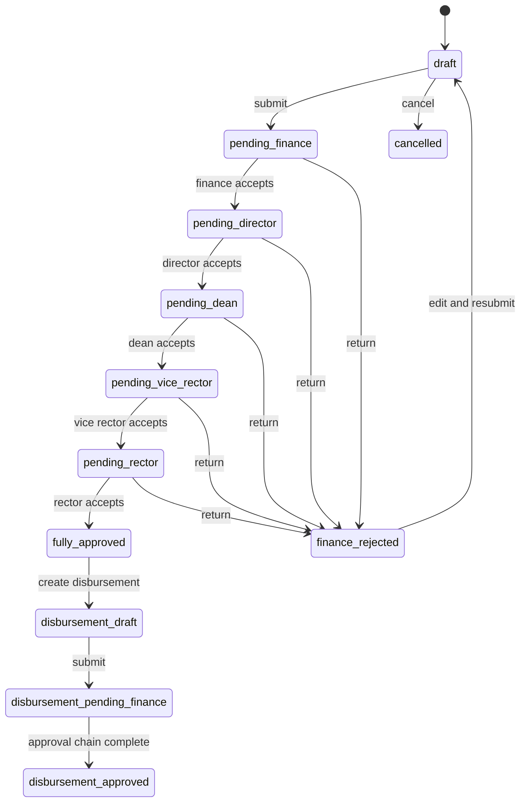

# PEMA — วิเคราะห์ระบบและ Functional Specification เบื้องต้น

สถานะเอกสาร: Draft สำหรับใช้วางแผนพัฒนาและออกแบบระบบใหม่  
วันที่สำรวจ: 28 สิงหาคม 2569 (Asia/Bangkok)  
แหล่งข้อมูลหลัก: [PEMA มหาวิทยาลัยขอนแก่น](https://fin.kku.ac.th/pema/) และ [Material 3 System Starter Template](https://app.notion.com/p/Material-3-System-Starter-Template-3b3f3b3cb76e807e8a16ce85d579ea1f?source=copy_link)

> เอกสารนี้แยกข้อเท็จจริงที่สังเกตได้ออกจากข้ออนุมานและข้อเสนอ เพื่อให้ทีมพัฒนาตรวจสอบกับเจ้าของกระบวนงานและฐานข้อมูลจริงก่อน implement

## เอกสารทีมพัฒนา

- [Team delivery map](./teams/README.md)
- [Frontend UX/UI](./teams/frontend-ux-ui/README.md)
- [Backend API](./teams/backend-api/README.md)
- [Infrastructure](./teams/infrastructure/README.md)

## 1. Executive summary

PEMA เป็นระบบบริหารค่าใช้จ่ายโครงการ/การฝึกอบรมของ มข. มีสองกระบวนงานหลัก:

1. **หลักการขอใช้งบประมาณ** — สร้างคำขอ ระบุรายละเอียดโครงการ งบประมาณ วิทยากร และเอกสาร แล้วส่งเข้าสายอนุมัติ
2. **การเบิกจ่าย** — สร้างคำขอเบิกจากหลักการที่อนุมัติแล้ว และส่งเข้าสายอนุมัติ/การเงิน

หน้าเว็บปัจจุบันทำหน้าที่เป็นทั้ง dashboard, รายการคำขอ, และฟอร์มธุรกรรมแบบยาวมาก จุดแข็งคือมีการคำนวณยอดและตรวจเพดานค่าใช้จ่ายตามกฎธุรกิจหลายรายการอยู่แล้ว จุดเสี่ยงหลักคือการจัดลำดับข้อมูลบนมือถือ, ความสอดคล้องของ required validation กับเครื่องหมาย `*`, การผูก label/accessibility และการขาดหน้า detail/workflow ที่สังเกตได้เมื่อไม่มีข้อมูลตัวอย่าง

## 2. ขอบเขตและระดับความเชื่อมั่น

| ระดับ | ความหมาย | ตัวอย่าง |
|---|---|---|
| Observed | อ่านจากหน้าจอ DOM/form หรือทดลองกดปุ่มแบบไม่บันทึก | route, field, status filter, dynamic row |
| Inferred | อนุมานจากชื่อสถานะ/สคริปต์/ข้อความบนหน้า | ลำดับผู้อนุมัติ, role ที่รับผิดชอบ |
| Proposed | ข้อเสนอสำหรับระบบรุ่นถัดไป | wizard, API contract, Material 3 token |

สิ่งที่ยังยืนยันไม่ได้จาก session นี้: รายละเอียดคำขอจริง, หน้าอนุมัติของแต่ละ role, เงื่อนไขการ reject/cancel ในทุกจุด, payload/API หลัง submit และสิทธิ์ระดับข้อมูล เพราะรายการปัจจุบันเป็นศูนย์และไม่ได้ส่งข้อมูลจริง

## 3. Current information architecture

### 3.1 Routes ที่ตรวจพบ

| Route | หน้าที่ | พฤติกรรมที่ตรวจพบ |
|---|---|---|
| `/pema/` | entry/dashboard | แสดงหน้า dashboard ของผู้ใช้ที่เข้าสู่ระบบ |
| `/pema/dashboard` | ภาพรวม | สรุปจำนวนตามสถานะของหลักการและการเบิกจ่าย พร้อมรายการล่าสุด |
| `/pema/expense` | รายการหลักการ | กรองตาม status, ค้นหาแบบ GET, ไปหน้าสร้างคำขอ |
| `/pema/expense/create` | สร้างหลักการ | ฟอร์มยาว, เพิ่มรายการแบบ dynamic, บันทึกร่างหรือส่งการเงิน |
| `/pema/disburse` | รายการเบิกจ่าย | กรองตาม status, ค้นหา, ลิงก์กลับไปยังหลักการที่อนุมัติแล้ว |
| `/pema/expense/store` | legacy form action | endpoint POST ที่ฟอร์มสร้างหลักการใช้ส่งข้อมูล |

ลิงก์ `ออกจากระบบ` ที่เห็นเป็น GET route แต่ไม่ได้กดเพื่อรักษา session และไม่ควรถือเป็นข้อสรุปด้าน security ว่าเป็น implementation ที่เหมาะสม

### 3.2 Navigation

- แบรนด์ PEMA พร้อมคำอธิบาย “แอปพลิเคชันบริหารจัดการ / ค่าใช้จ่ายโครงการฯ”
- เมนูหลัก: หน้าหลัก, หลักการ, เบิกจ่าย
- แสดง context ของผู้ใช้และ role เป็น “เจ้าหน้าที่”
- desktop ใช้ top navigation; mobile ยุบเป็นเมนู hamburger
- CTA สำคัญคือ `+ สร้างคำขอหลักการ`

## 4. Dashboard ที่มีอยู่จริง

Dashboard แบ่งเป็นสอง section ที่รูปแบบเหมือนกัน:

### หลักการขอใช้งบประมาณ

มี summary card 6 สถานะ:

- ฉบับร่าง
- รอการเงิน (คณะ)
- รออนุมัติ (คณะ)
- รอรองอธิการบดี
- รออธิการบดี
- อนุมัติแล้ว

มีตาราง “หลักการล่าสุด” คอลัมน์: เลขที่, โครงการ, งบประมาณ, สถานะ, วันที่สร้าง และ action column

### การเบิกจ่าย

มี summary card 6 สถานะ:

- ฉบับร่าง
- รอการเงิน
- รออนุมัติ
- รอรองอธิการบดี
- รออธิการบดี
- อนุมัติแล้ว

มีตาราง “เบิกจ่ายล่าสุด” คอลัมน์: เลขที่, โครงการ, ยอดเบิก, สถานะ, วันที่สร้าง และ action column

### ข้อเสนอปรับ dashboard

- ทำให้ summary card เป็น filter action ที่มี `aria-pressed`/selected state และ deep-link ได้
- แสดง “งานที่ต้องทำ” แยกจาก “ตัวเลขรวม” เช่น จำนวนที่รอการเงินของผู้ใช้
- เพิ่ม status timeline และเวลาที่ค้างในแต่ละขั้น
- เมื่อไม่มีข้อมูล ให้มี empty state ที่มี next action เดียวและคำอธิบายสั้น
- เพิ่ม filter ปีงบประมาณ, หน่วยงาน, ช่วงวันที่ และประเภทโครงการเมื่อจำนวนรายการมากขึ้น

## 5. หน้ารายการคำขอ

### 5.1 รายการหลักการ

มี status filter ดังนี้:

`ทั้งหมด`, `ฉบับร่าง`, `รอการเงิน`, `รอผู้เห็นชอบ`, `รอผู้อนุมัติ`, `รอรองอธิการบดี`, `รออธิการบดี`, `อนุมัติแล้ว`, `ถูกส่งกลับ`, `ยกเลิกแล้ว`

มี search field สำหรับค้นหา: ชื่อโครงการ, เลขที่, หน่วยงาน, ผู้ขอ และส่ง query ผ่าน `search`

### 5.2 รายการเบิกจ่าย

มี status filter ดังนี้:

`ทั้งหมด`, `ฉบับร่าง`, `รอการเงิน`, `รอผู้เห็นชอบ`, `รอผู้อนุมัติ`, `รอรองอธิการบดี`, `รออธิการบดี`, `อนุมัติแล้ว`, `ถูกส่งกลับ`

มี search field สำหรับค้นหา: เลขที่เบิกจ่าย, ชื่อโครงการ, หน่วยงาน, ผู้ขอ และมีลิงก์ไปยังหลักการที่ `อนุมัติแล้ว`

### ข้อเสนอปรับรายการ

- desktop: data table ที่มี sorting, pagination, column visibility และ row action
- mobile: เปลี่ยนเป็น request card ไม่บีบตารางให้เล็กลง
- status filter ใช้ scrollable filter chips และแสดงจำนวนใน chip
- ค้นหาแบบ debounce พร้อมปุ่มล้างค่าและข้อความผลลัพธ์ เช่น “พบ 12 รายการจากคำค้น…”
- preserve query/filter ใน URL เพื่อแชร์และกดย้อนกลับได้
- แสดงเลขที่, ชื่อโครงการ, ยอดเงิน, ผู้ขอ, ขั้นตอนปัจจุบัน, วันที่แก้ไขล่าสุด และ action ที่ทำได้ตาม role

## 6. โครงสร้างฟอร์มสร้างหลักการ

ฟอร์มใช้ `POST /pema/expense/store` และมี action สองแบบคือ `บันทึกฉบับร่าง` กับ `บันทึกและส่งการเงิน`

### 6.1 ข้อมูลโครงการ/การฝึกอบรม

- ชื่อโครงการ/การฝึกอบรม
- ประเภทโครงการ: การฝึกอบรม, ดำเนินโครงการ, การฝึกอบรมและดำเนินโครงการ, ประชุมระดับนานาชาติ
- หน่วยงานผู้จัด / เบอร์ติดต่อ
- วันที่เริ่มและวันที่สิ้นสุด
- สถานที่จัด
- ประเภทสถานที่: ภายในมหาวิทยาลัย, ภายนอกมหาวิทยาลัย, ต่างประเทศ
- จำนวนผู้เข้าร่วม
- ค่าเข้าร่วมอบรม: ไม่เก็บ, เก็บ, ทั้งสองกรณี
- หมายเหตุ

### 6.2 งบประมาณและยุทธศาสตร์

- บรรจุในแผน / ไม่บรรจุในแผน
- โครงการใหม่ / โครงการต่อเนื่อง
- ประเด็นยุทธศาสตร์, กลยุทธ์, OKR, SDG
- รหัสแผนงาน 4 หลัก
- รหัสแผนงานย่อย 6 หลัก
- รหัสโครงการ 6 หลัก
- ประเภทผู้เข้าร่วม 3 กรณี โดยมีข้อความกฎระเบียบยาว
- หลักการและเหตุผล
- วัตถุประสงค์
- กลุ่มเป้าหมาย
- ผลที่คาดว่าจะได้รับ
- ตัวชี้วัดผลสำเร็จ

### 6.3 ข้อ 20 — การจัดจ้างผู้จัดฝึกอบรม

ตัวเลือก radio 3 แบบ:

1. ไม่จัดจ้างจัดฝึกอบรมโครงการหรือหลักสูตร
2. จัดจ้างทั้งหมด
3. จัดจ้างบางส่วน

ข้อเสนอ: แสดงคำอธิบายเฉพาะตัวเลือกที่เลือก และถามรายละเอียดการจัดจ้างต่อเมื่อเลือกแบบทั้งหมด/บางส่วน เพื่อลด cognitive load

### 6.4 รายการค่าใช้จ่ายหลัก

กด `+ เพิ่มรายการ` เพื่อเพิ่มแถวแบบ dynamic โดยพบ behavior ต่อไปนี้:

- ค้นหาประเภทค่าใช้จ่ายจากรายการตามระเบียบ
- แสดงเพดาน/อัตราสูงสุดหลังเลือกประเภท
- กรอกจำนวน, หน่วย, อัตราต่อหน่วย และข้อมูลเพิ่มเติม
- checkbox `ว.119` และ `ระบุรายการจ้างฝึกอบรม`
- คำนวณจำนวนเงินและยอดรวมอัตโนมัติ
- แจ้งเตือนเมื่อเกินอัตรา
- แสดงยอดรวมค่าใช้จ่ายหลัก, ค่าสมนาคุณวิทยากร และยอดรวมทั้งสิ้น
- มีปุ่มลบแถว

จากสคริปต์ที่โหลดบนหน้า พบฟังก์ชัน/กฎที่เกี่ยวข้องกับ `RATES`, `filterTypeDropdown`, `recalcRow`, `updateGrandTotal`, `syncV119List` และ `syncContractedList`

### 6.5 ค่าใช้จ่ายอื่นๆ

ค่าเริ่มต้นมี 3 หมวด:

- ค่าใช้จ่ายตามระเบียบพัสดุ
- ค่าล่วงเวลา
- ค่าเดินทางไปปฏิบัติงาน

กด `+ เพิ่มรายการ (ค่าใช้จ่ายอื่นๆ)` เพื่อเพิ่มหมวด “ค่าใช้จ่ายอื่นๆ” พร้อมรายละเอียดและจำนวนเงิน ระบบแจ้งเตือนว่าเพิ่มรายการประเภทนี้ได้เพียง 1 รายการ

### 6.6 ค่าสมนาคุณวิทยากร

กด `+ เพิ่มช่วงการบรรยาย` เพื่อเพิ่ม session โดยมี:

- ชื่อหัวข้อ/ช่วง
- ประเภท: บรรยาย, อภิปราย/เสวนา, แบ่งกลุ่ม
- จำนวนชั่วโมง 0.5 ถึง 30 ชั่วโมง เพิ่มครั้งละ 0.5
- จำนวนกลุ่มเมื่อเป็นการแบ่งกลุ่ม
- เพิ่มรายชื่อวิทยากร
- ประเภทวิทยากร, สถานะพิเศษ, อัตราต่อชั่วโมง และเพดาน
- คำนวณยอดต่อช่วงและยอดรวม

กฎที่แสดงบนหน้า:

- บรรยาย: ไม่เกิน 1 คน
- อภิปราย/เสวนา: ไม่เกิน 5 คน
- แบ่งกลุ่ม: ไม่เกิน 2 คนต่อกลุ่ม

จากสคริปต์พบการตรวจ `checkSpeakerCount`, `checkGroupSpeakerLimit`, `updateSpeakerRate`, `recalcSpeakerRow` และแจ้งเตือนกรณีเกินจำนวน นอกจากนี้วิทยากรพิเศษอาจต้องแนบไฟล์ประวัติ/ประสบการณ์ให้ครบ

### 6.7 ไฟล์แนบ

ข้อความบนหน้าอนุญาต PDF, Word, Excel และรูปภาพ ไม่เกิน 10 MB ต่อไฟล์ โดยปุ่ม `+ เพิ่มไฟล์แนบ` จะสร้างช่องเลือกไฟล์และช่องป้ายกำกับ

สิ่งที่ควรตรวจสอบ/แก้ให้ชัด:

- input ที่ตรวจพบจากหน้าเป็นการเลือกทีละไฟล์ (`multiple=false`) แม้ข้อความอาจสื่อว่าเลือกได้หลายไฟล์
- ตรวจ MIME, extension, ขนาด และเนื้อหาไฟล์ที่ server ไม่ใช่พึ่ง client อย่างเดียว
- ใช้ private object storage และ signed URL สำหรับการอ่าน
- แสดง progress, retry, remove และ upload error แยกต่อไฟล์
- ป้องกันชื่อไฟล์อันตรายและไฟล์ที่อัปโหลดซ้ำ

## 7. State machine ที่อนุมานได้

สถานะด้านล่างเป็นการรวมจาก status filter และ summary card ยังต้องยืนยันกับเจ้าของกระบวนงาน:



ข้อเสนอสำคัญ: อย่าเก็บสถานะเป็นข้อความภาษาไทยในฐานข้อมูล ให้ใช้ enum ที่เสถียร เช่น `PENDING_FINANCE` แล้วแปลผลผ่าน locale/label map

## 8. Actors และสิทธิ์ที่ควรออกแบบ

| Actor ที่อนุมานจากหน้าจอ | งานหลัก | สิทธิ์ที่ควรมี |
|---|---|---|
| ผู้ขอ/เจ้าหน้าที่ | สร้าง แก้ไข draft ส่งคำขอ ดูผล | create/read/update ของคำขอที่ตนเป็นเจ้าของ |
| การเงินคณะ | ตรวจความครบถ้วน/อัตรา/เอกสาร | review, return, forward พร้อมเหตุผล |
| ผู้เห็นชอบ | พิจารณาคำขอระดับคณะ | approve/return ตาม scope |
| ผู้อนุมัติ/คณบดี | อนุมัติระดับคณะ | approve/return ตามหน่วยงาน |
| รองอธิการบดี | อนุมัติระดับมหาวิทยาลัย | approve/return |
| อธิการบดี | อนุมัติขั้นสูงสุด | approve/return |
| ผู้ดูแลระบบ | จัดการ master data/กฎอัตรา/สิทธิ์ | admin เฉพาะ resource ที่กำหนด |

สิทธิ์จริงต้องยืนยันด้วย role matrix และ ownership/RLS ระดับข้อมูล ไม่ควรอนุญาตจากการซ่อนปุ่มเพียงอย่างเดียว

## 9. Current UX/UI findings

### จุดแข็ง

- ภาษาและ label ตรงกับกระบวนงานไทย
- แยกหลักการและเบิกจ่ายเป็น navigation destination ที่เข้าใจง่าย
- มี status summary และ deep link filter
- มีกฎอัตรา/เพดานและการคำนวณยอดในฟอร์ม
- ใช้ Sarabun ซึ่งเหมาะกับข้อความภาษาไทย
- มี empty state เมื่อไม่มีข้อมูล และมี CTA เริ่มต้น
- console error/warning ไม่พบจากหน้าที่ตรวจใน session นี้

### ปัญหาและความเสี่ยง

| ระดับ | หลักฐาน | ผลกระทบ | แนวทางแก้ |
|---|---|---|---|
| สูง | ที่ viewport 390px ตารางค่าใช้จ่ายหลักกว้างประมาณ 834px และตารางค่าใช้จ่ายอื่นกว้างประมาณ 566px ขณะที่พื้นที่เนื้อหาประมาณ 375–390px | ต้องเลื่อน/เนื้อหาถูกตัด อ่านและกรอกยาก | ใช้ table-to-card บนมือถือ หรือ horizontal scroll container ที่มี affordance ชัดเจน |
| สูง | ฟอร์มสร้างคำขอยาวประมาณ 4,400px บนมือถือ | ผู้ใช้หลง section และพลาดข้อผิดพลาด | แบ่งเป็น multi-step wizard + step summary + sticky actions |
| สูง | UI ใส่ `*` ให้ประเภทโครงการ, บรรจุในแผน, ลักษณะโครงการ และประเภทผู้เข้าร่วม แต่ browser-required ที่ตรวจพบมีเพียงชื่อ, หน่วยงาน, วันที่เริ่ม, วันที่สิ้นสุด | ผู้ใช้เห็นกติกาไม่ตรงกับ validation | ใช้ Zod schema เดียวเป็น source of truth และ render required จาก schema |
| สูง | accessibility tree รายงาน textbox/combobox จำนวนมากไม่มี accessible name; label ส่วนใหญ่ไม่มี `for` ที่ผูกกับ control | screen reader/keyboard user ใช้งานไม่แน่นอน | ใช้ outlined field component ที่ผูก `id`, `label`, `aria-describedby`, error id |
| กลาง | สถานะมีทั้ง “รอการเงิน (คณะ)” และ “รอการเงิน” รวมถึง “รออนุมัติ”/“รอผู้เห็นชอบ”/“รอผู้อนุมัติ” | ผู้ใช้สับสนว่าต่างกันอย่างไร | ใช้ status dictionary เดียว แสดง actor + action ที่รอ |
| กลาง | หลาย section ใช้ emoji เป็น icon หลัก | ความหมายไม่คงที่และอาจไม่เหมาะกับบริบทองค์กร | ใช้ M3 icon ที่มี accessible label และใช้สีเป็น secondary cue |
| กลาง | สีหลายสีและ shadow custom โดยยังไม่เห็น semantic token กลาง | theme/dark mode/consistency ขยายยาก | ย้ายเป็น Material 3 role token |
| กลาง | ปุ่มบันทึก draft และส่งการเงินอยู่ท้ายฟอร์มยาว | เสี่ยงกรอกแล้วหลุดก่อนบันทึก | ปุ่มบันทึก draft แบบ sticky, unsaved changes guard; autosave ค่อยเพิ่มหลัง MVP |
| ต่ำ | date input แสดง placeholder `mm/dd/yyyy` ในหน้าไทย | ผู้ใช้บางกลุ่มสับสนรูปแบบวัน/เดือน/ปี | แสดงรูปแบบไทยข้าง field และใช้ locale-aware date picker |

## 10. Target functional requirements

### P0 — ต้องมีใน MVP

- สร้าง/แก้ไข/ลบร่างหลักการ
- validation ฝั่ง client และ server จาก schema เดียว
- save draft แบบ explicit ที่แสดง timestamp (autosave พิจารณาหลัง MVP)
- ส่งคำขอเข้าสู่สถานะ `PENDING_FINANCE`
- status timeline, current owner/actor และ return reason
- รายการหลักการและเบิกจ่ายแบบค้นหา/กรอง/แบ่งหน้า
- dynamic budget items พร้อม rate catalog และ cap explanation
- other expenses, sessions, speakers, attachments
- role-based action และ server-side authorization
- mobile 320/375/414px ที่ไม่ทำให้ข้อมูลสำคัญถูกตัด
- audit trail ทุกการเปลี่ยนสถานะและการแก้ยอดเงิน

### P1 — ควรมีหลัง MVP

- notification/in-app inbox เมื่อมีงานรอ
- export PDF/Excel ที่ตรวจยอดกับหน้าจอ
- bulk review สำหรับการเงิน
- saved filters และ recent searches
- realtime update ของรายการ/สถานะ (เลื่อนไปหลัง MVP)
- dashboard analytics เช่น cycle time และรายการค้างเกิน SLA

## 11. Fast-lane technical architecture

เพื่อให้พัฒนาเร็ว ให้เริ่มด้วย **modular monolith** ก่อน ไม่แยก microservices และไม่เพิ่ม infrastructure ที่ยังไม่มี use case จริง

```text
Browser
  -> Next.js App Router (หนึ่ง repository / หนึ่ง deploy)
  -> Server Components: dashboard/list/detail/read
  -> Server Actions: save draft/submit/approve/return/cancel
  -> PostgreSQL + Prisma (หนึ่ง data access path)
  -> Private object storage สำหรับไฟล์แนบ
```

มาตรฐาน MVP:

- UI: Tailwind/CSS + Material 3 semantic tokens และ wrapper components ขนาดเล็ก
- Form: `@tanstack/react-form` + Zod เท่านั้น
- Read: Server Components + repository functions; ยังไม่ต้องมี client cache library
- Write: Server Actions; ใช้ Route Handler เฉพาะ upload/download/webhook ที่จำเป็น
- Auth: ต่อ KKU SSO/ผู้ให้บริการเดิมผ่าน adapter เดียว ไม่สร้าง auth service ใหม่
- Authorization: helper กลางตรวจ role + ownership/scope ที่ server ทุก mutation
- Deploy: แอปเดียวและฐานข้อมูลเดียวก่อน

สิ่งที่ **ยังไม่ทำใน MVP**: tRPC, TanStack Query, Zustand, XState, realtime, background job, notification service, analytics pipeline และ API gateway แยก

> Baseline นี้ใช้ PostgreSQL + Prisma; หากมีข้อจำกัดให้ใช้ Supabase แทนทั้งชุดและเปิด RLS ให้ครบ ห้ามผสม data access path สองแบบใน MVP

## 12. Minimal domain/API

เริ่มจาก entity เท่าที่จำเป็น:

`User/Role`, `Department`, `ExpenseRequest`, `ExpenseItem`, `TrainingSession/Speaker`, `Attachment`, `ApprovalEvent`, `RateCatalog`

รวม `OtherExpenseItem` ไว้ใน `ExpenseItem` ด้วย `category` เพื่อลดตารางและ logic ซ้ำ รวม `ApprovalStep`/`ApprovalAction` เป็น `ApprovalEvent` ที่เก็บสถานะก่อน-หลัง เหตุผล ผู้กระทำ และเวลา

ใช้ server functions เป็น contract หลักก่อน ไม่ต้องสร้าง REST ครบชุด:

```text
getRequests(filters)
getRequest(id)
saveDraft(input)
submitRequest(id)
reviewRequest(id, decision, reason)
createDisbursement(expenseId, input)
```

กฎข้อมูลขั้นต่ำ:

- server คำนวณยอดรวมและเพดานใหม่ทุกครั้ง
- transition ต้องตรวจ current status และสิทธิ์ของ actor
- การส่งกลับต้องมีเหตุผล
- attachment metadata ต้องผูกกับ request และตรวจไฟล์ที่ server
- rate catalog มี `effectiveYear`/version อย่างน้อยหนึ่งค่า

## 13. Validation contract ที่ควรทำเป็น schema เดียว

- `projectName`, `organizerDept`, `startDate`, `endDate` required
- field ที่ UI ระบุ `*` ต้อง required ใน schema เดียวกันทั้งหมด
- `startDate <= endDate`
- จำนวนคน/ชั่วโมง/จำนวนรายการต้องไม่ติดลบ และใช้ step ที่กำหนด
- รหัสแผนงาน/แผนงานย่อย/โครงการตรวจความยาวและตัวเลขตามกติกา
- รายการค่าใช้จ่ายต้องมีประเภท, จำนวน, หน่วย และอัตราที่สมเหตุผล
- rate เกินเพดานต้องแสดง field error + cap detail; ไม่ควรปรับค่าผู้ใช้เงียบ ๆ
- จำนวนวิทยากรต้องถูกตรวจทั้งระดับ session และระดับกลุ่ม
- วิทยากรพิเศษต้องมี attachment ตามกฎที่ยืนยันกับเจ้าของงาน
- attachment ต้องตรวจ extension, MIME, ขนาด, จำนวน และผล antivirus ฝั่ง server
- submit ต้อง revalidate ทั้ง object และ permission ใหม่ทุกครั้ง

## 14. แผนพัฒนาแบบสั้น

1. **Foundation** — Next.js shell, M3 tokens, field wrappers, auth adapter, role/status enum
2. **Read path** — dashboard, list, detail, search/filter และ empty/loading/error state
3. **Write path** — wizard หลักการ, draft, expense/speaker/attachment, submit/review
4. **Disbursement + verify** — เบิกจ่ายจากหลักการที่อนุมัติ, audit, mobile/a11y/E2E และ production readback

งานที่เลื่อนได้หลัง MVP: realtime, notification, export ขั้นสูง, analytics, bulk review และ service แยก

## 15. Acceptance criteria สำหรับรอบแรก

- ผู้ใช้สร้าง draft โดยไม่กรอกข้อมูลครบได้ และกลับมาแก้ต่อได้
- ระบบแสดง required/error ที่ตรงกันระหว่าง label, field, schema และ server response
- เมื่อเลือก expense type ระบบแสดง unit/rate/cap ที่ตรวจสอบย้อนกลับได้
- ยอดรวมหลัก/อื่นๆ/วิทยากร/ทั้งหมดตรงกันทุกครั้งหลังเพิ่ม แก้ ลบ หรือเปลี่ยนค่า
- ไม่มีตารางใดถูกตัดหรือทำให้ต้อง zoom ที่ 320, 375, 414px
- keyboard tab order เดินตามลำดับ, focus ring เห็นชัด, error ถูกอ่านผ่าน `aria-describedby`
- ผู้ใช้เห็นขั้นตอนปัจจุบัน ผู้รับผิดชอบ และเหตุผลเมื่อถูกส่งกลับ
- ทุก action สำคัญมี audit event และไม่เกิด double submit
- test ครอบคลุม happy path, cap exceeded, duplicate click, attachment failure, stale approval และ unauthorized access

## 16. Open questions ก่อน implement

- “รอผู้เห็นชอบ” กับ “รอผู้อนุมัติ” ต่างกันที่ actor ใด และใช้ในหลักการ/เบิกจ่ายเหมือนกันหรือไม่
- การส่งกลับต้องย้อนเป็น draft หรือสถานะเฉพาะ และใครแก้ได้บ้าง
- เบิกจ่ายหนึ่งรายการผูกกับหนึ่งหลักการหรือแยกหลายงวดได้
- ปีงบประมาณและประกาศอัตราใช้ version ใด และมีผลย้อนหลังหรือไม่
- ไฟล์แนบใดบังคับในแต่ละประเภทโครงการ/ผู้เข้าร่วม/วิทยากร
- ต้องรองรับลายเซ็นอิเล็กทรอนิกส์หรือเอกสาร PDF ที่มีลายเซ็นหรือไม่
- ต้องเชื่อมข้อมูลหน่วยงาน/บุคลากร/แผนงานจากระบบกลางใด
- retention, audit export และ PDPA/data classification ของเอกสารการเงินเป็นอย่างไร
